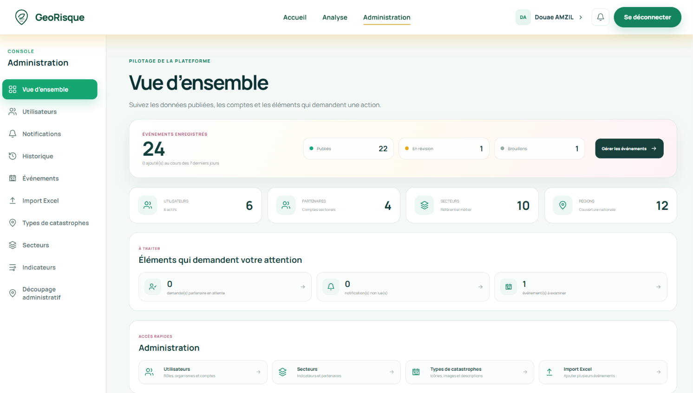
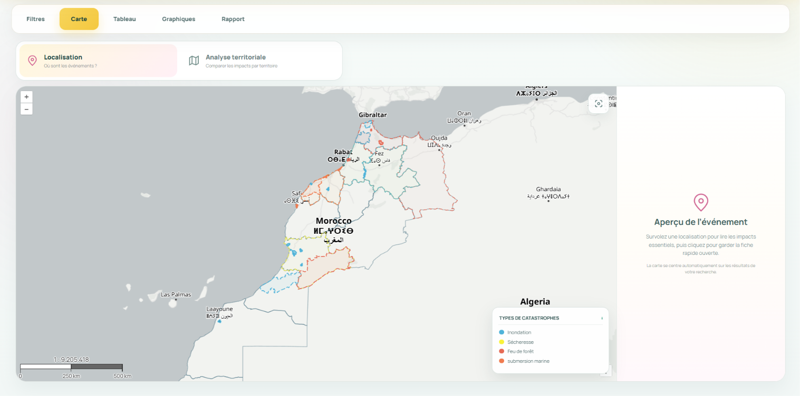
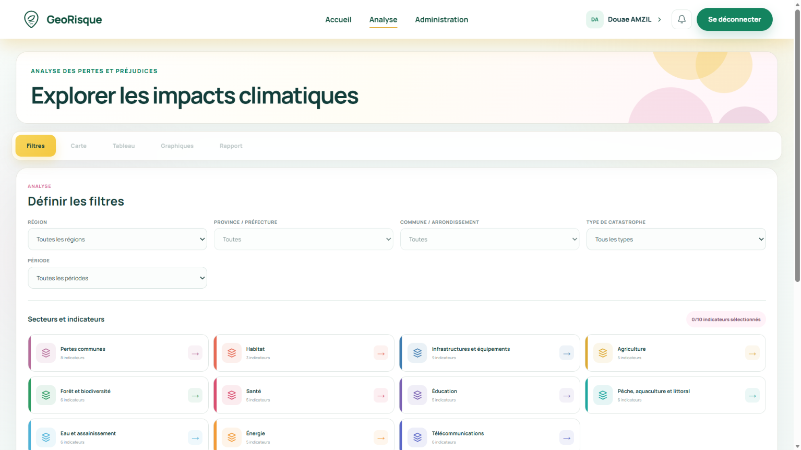
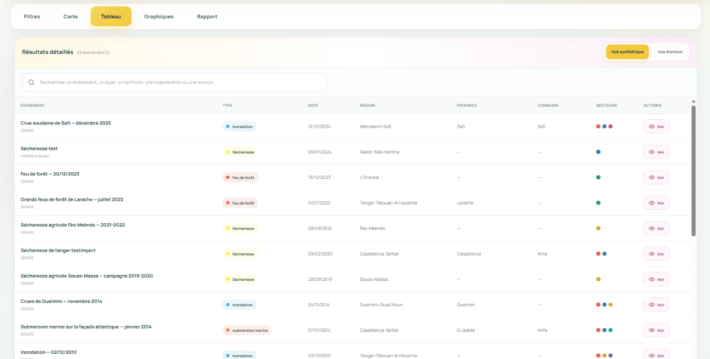
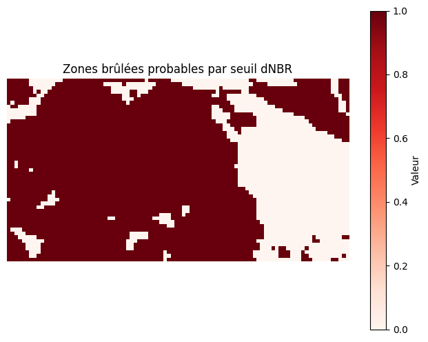
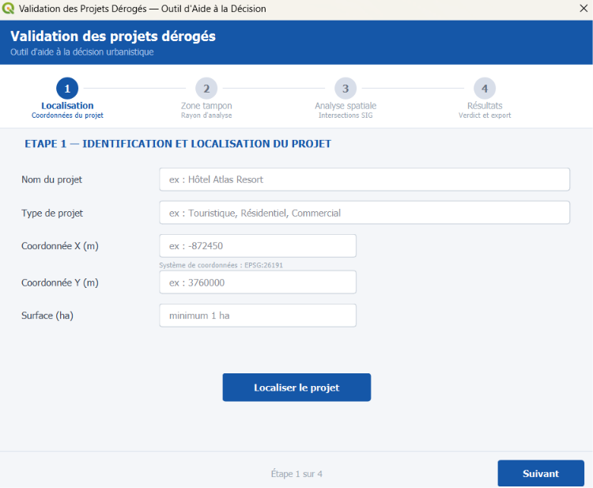
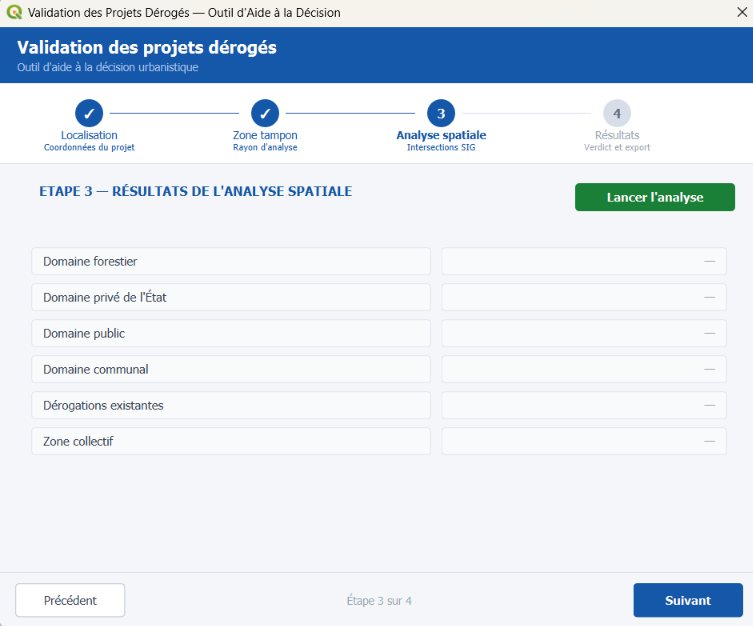
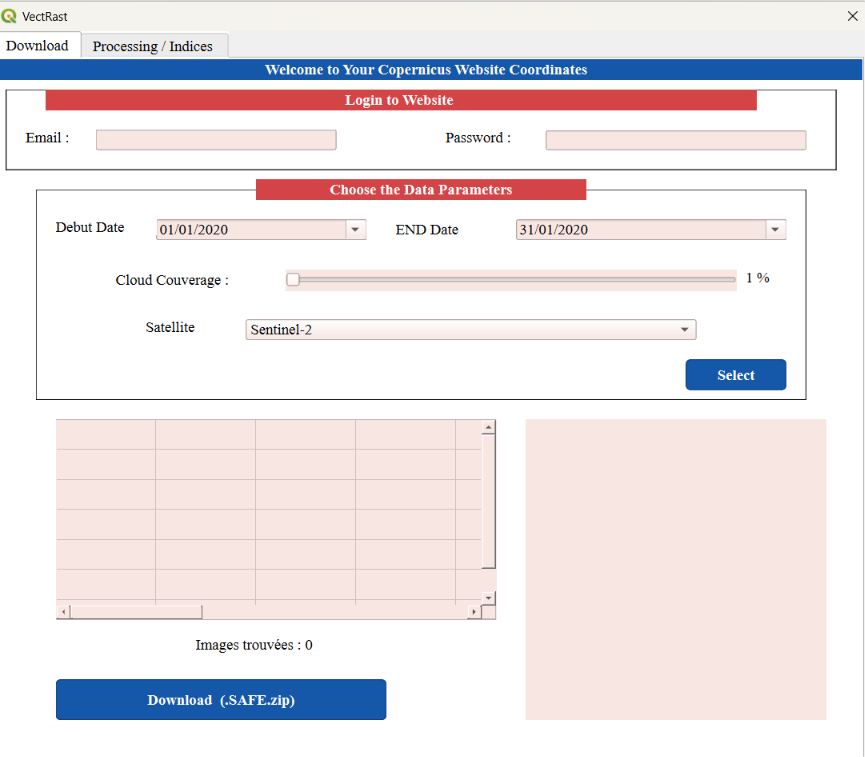
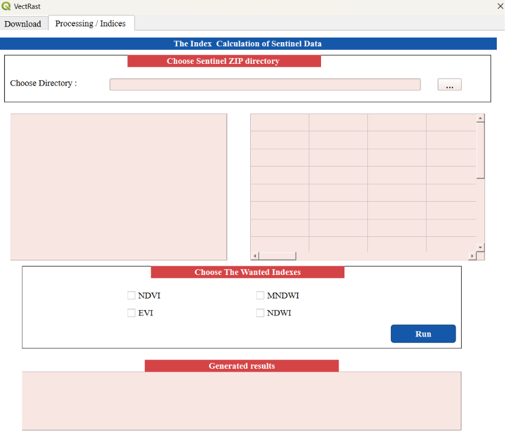

# Hi, I'm Douae AMZIL 👋

I am a Geoinformation Engineering student with a background in Computer Engineering.

My work combines GIS, spatial analysis, remote sensing, GeoAI and WebGIS development. I enjoy transforming spatial data into maps, analytical tools and decision-support solutions.

I have worked on projects involving:
- 🗺️ GIS & spatial decision support
- 🛰️ Remote sensing and satellite image analysis
- 🤖 GeoAI and supervised classification
- 🌐 WebGIS development
- 🧩 QGIS plugin development and workflow automation
- 🗄️ Spatial databases with PostgreSQL/PostGIS

Currently looking for a **6-month PFE internship starting in 2027**.

📍 Morocco

# Featured Projects

## 🌍 Loss & Damage WebGIS Platform

Development of a WebGIS platform for managing, mapping and analyzing climate-related disasters, losses and damages in Morocco.

The platform supports spatial data management, multi-level territorial analysis, collaborative data contribution and decision-support visualization.

### Main features
- Interactive mapping of disaster events and affected territories
- Region → Province → Commune spatial filtering
- Management of points, lines and polygons
- Sector-based loss and damage indicators
- Thematic maps and spatial/statistical analysis
- Event submission and validation workflow
- Partner and administrator role management
- Spatial data validation using PostGIS
- Analysis dashboards, tables and charts

### Technologies
`React` `Vite` `Leaflet` `Node.js` `Express` `PostgreSQL/PostGIS` `GeoJSON` `REST API` `Recharts`

### Project Preview

  
  

  
  

## 🔥 GeoAI Burned Area Detection — Derdara Forest

GeoAI workflow for detecting and mapping burned areas in Derdara Forest, Chefchaouen, using Sentinel-2 imagery and Random Forest classification.

### Main work
- Selected pre-fire and post-fire Sentinel-2 imagery
- Applied cloud and shadow masking
- Generated median composites
- Calculated NDVI, NBR and dNBR
- Detected burned areas using dNBR thresholding
- Created training samples
- Trained a Random Forest classifier
- Evaluated the classification results
- Compared dNBR and Random Forest burned-area estimates

### Results
- dNBR estimated burned area: **99.31 ha**
- Random Forest estimated burned area: **105.63 ha**
- Test accuracy: **100% on the selected test samples**

### Technologies
`Google Earth Engine` `Sentinel-2` `Random Forest` `Google Colab` `Remote Sensing` `GeoAI`

### Project Preview

  
  

## 🧩 QGIS Plugin — Urban Planning Decision Support & Remote Sensing

Development of a QGIS plugin combining vector spatial analysis and raster remote-sensing workflows.

### Vector Module

The vector module provides a decision-support workflow for the analysis of urban-planning derogation projects.

- Project identification and geographic localization
- Definition of buffer zones
- Spatial intersection analysis
- Analysis of public, private, communal and forest domains
- Detection of existing derogations
- Result generation and export

### Vector Workflow Preview

  
  

  
  

### Raster Module

The raster module integrates remote-sensing functionalities based on Sentinel satellite imagery.

- Satellite image search
- Copernicus data access
- Sentinel image download
- Raster processing
- Spectral index calculation
- NDVI, NDWI and EVI analysis

### Raster Workflow Preview

  
  

### Technologies
`Python` `PyQGIS` `QGIS` `Qt` `Vector Analysis` `Raster Processing` `Copernicus`

## 🌲 Forest Cover Change Monitoring — Maâmora Forest

Remote-sensing project for analyzing long-term and recent forest-cover changes in the Maâmora Forest, Morocco.

### Part 1 — Global Forest Change
- Digitized study areas in QGIS
- Exported study areas as GeoJSON
- Used the Global Forest Change dataset
- Analyzed tree cover, forest loss and forest gain
- Adapted and executed a Python notebook in Digital Earth Africa
- Generated maps and temporal graphs

### Part 2 — Sentinel-2 & NDVI
- Compared Sentinel-2 imagery between 2018 and 2024
- Produced RGB visualizations
- Calculated and compared NDVI
- Generated NDVI difference maps
- Produced histograms to analyze vegetation changes

### Technologies
`Digital Earth Africa` `QGIS` `Python` `GeoJSON` `Sentinel-2` `NDVI` `Remote Sensing`

## 🏫 School Site Selection & Optimal Road Route — Stowe, Vermont

GIS decision-support project for identifying a suitable location for a new school and determining an optimal access route.

### Main work
- Euclidean distance analysis
- Terrain slope analysis
- Land-use reclassification
- Weighted multi-criteria analysis
- Suitable-site selection
- Construction cost surface generation
- Cost Distance & Backlink analysis
- Least-cost path extraction
- ModelBuilder workflow

### Technologies
`ArcGIS` `ArcMap` `ModelBuilder` `Multi-Criteria Analysis` `Cost Distance` `Spatial Analysis`

### Project Preview

  

